# **Урок 1. Веб-технологии: вчера, сегодня, завтра**

## **Задача:**

1. На основе сайта https://pet7.ru/ 

- *Определите, на каком протоколе работает сайт.*

       Ответ https:// - защищеный

- *Проанализируйте структуру страницы сайта.*

1. Header

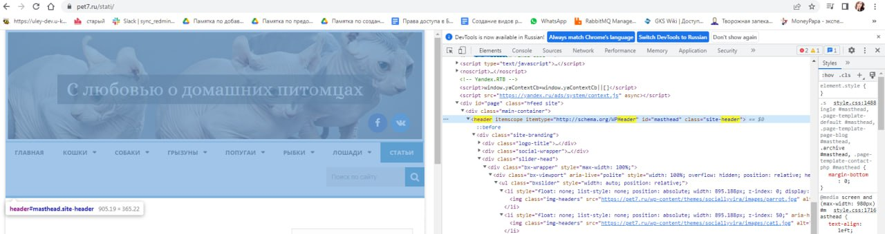

2. Content

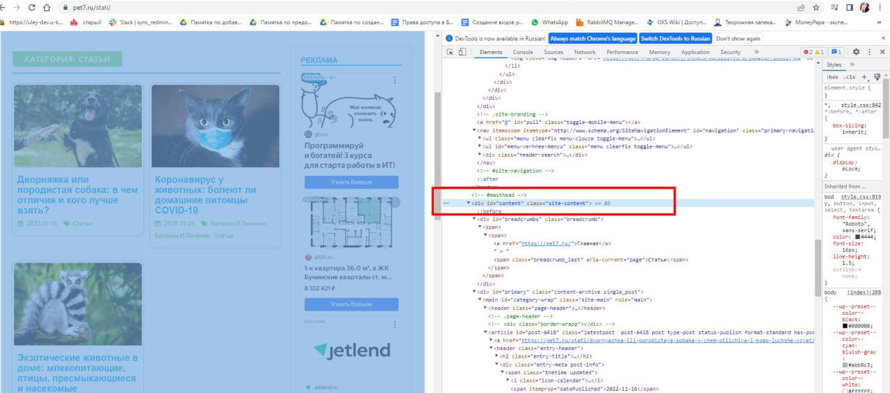

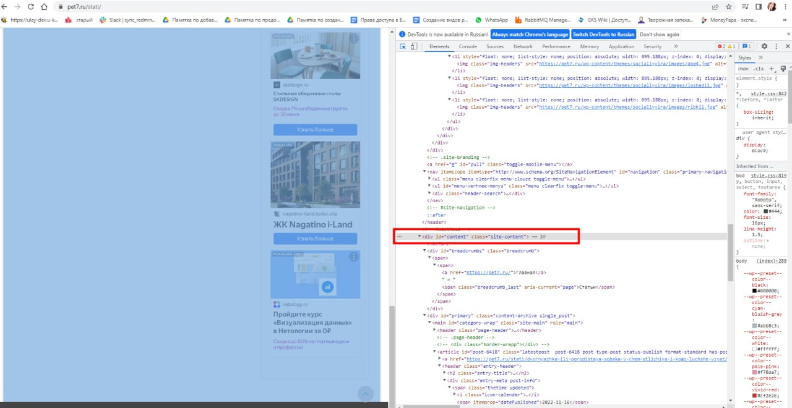

3. Navigation / viget

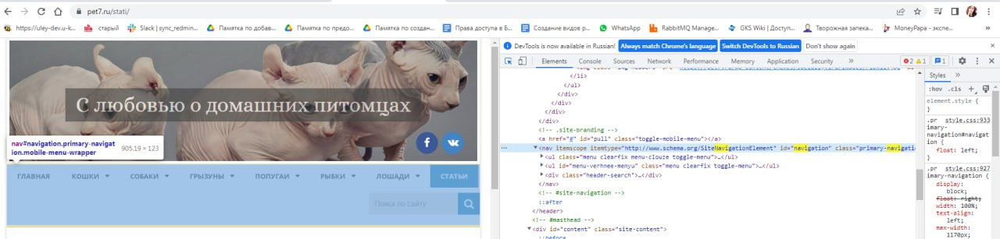

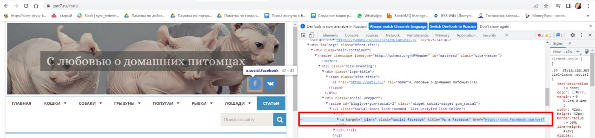

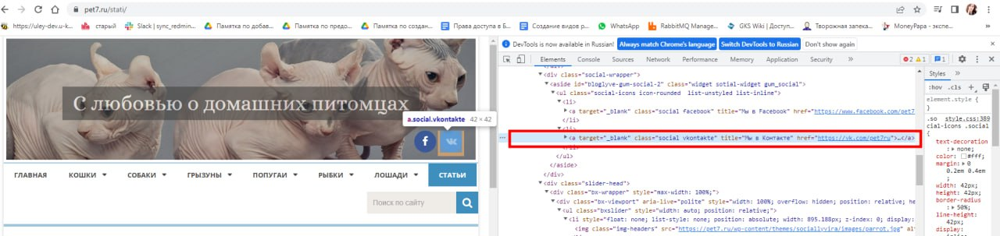

4. Footer

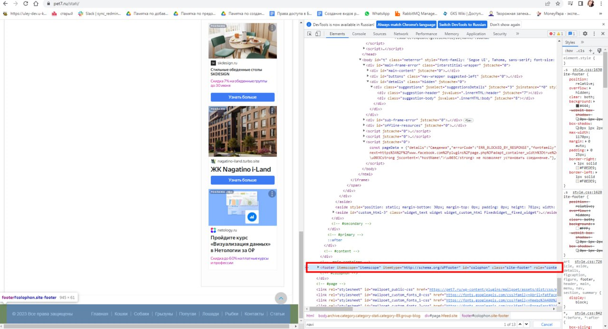

- *Внесите не менее 3 изменений на страницу с помощью инструмента разработчика и представьте скриншоты было/стало.*

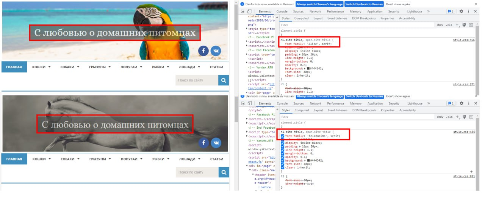

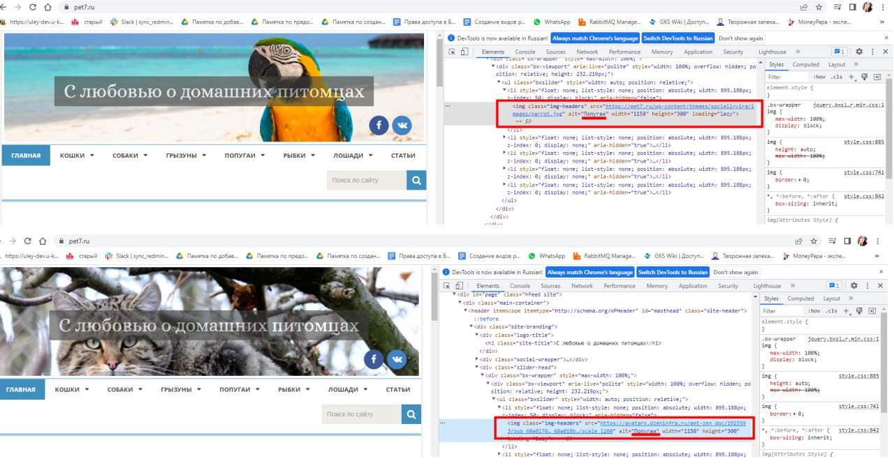

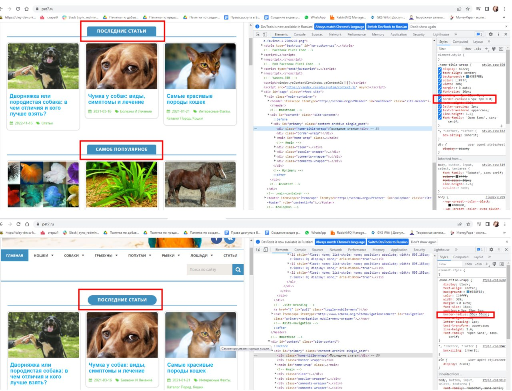

- *Создайте прототип низкой детализации.*

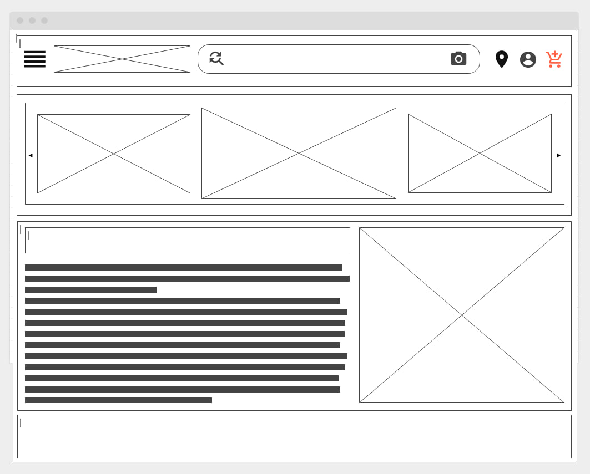

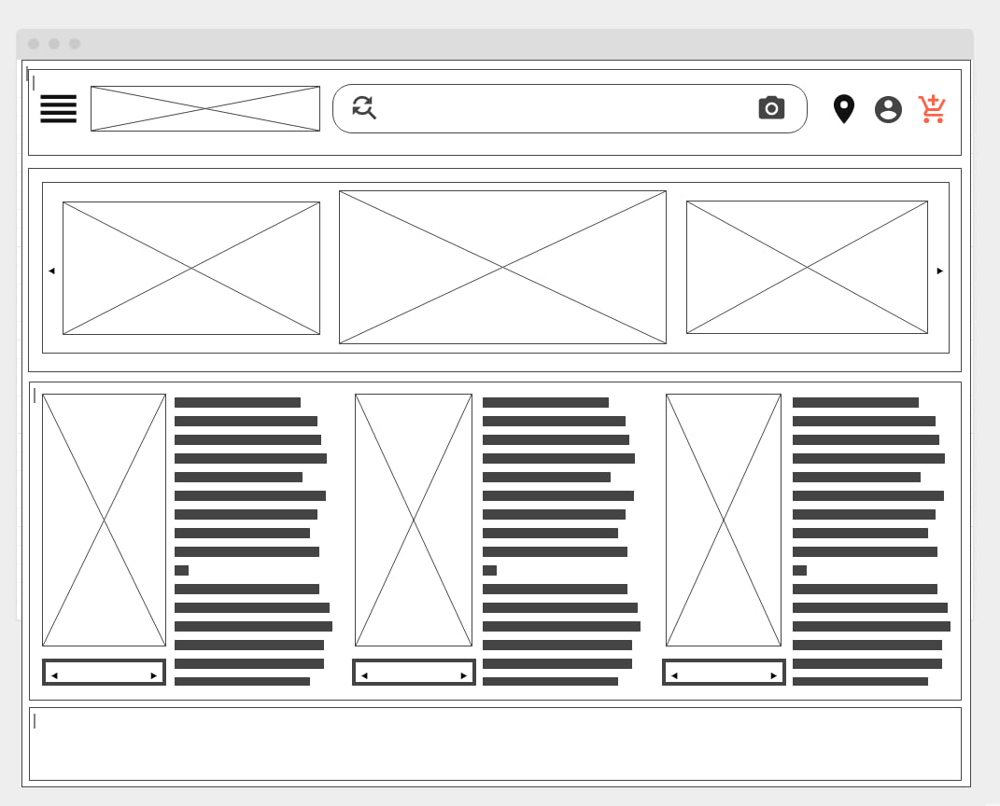

Сдайте в виде zip-архива со скриншотами результатов, назовите файл по смыслу работы. ИЛИ можете использовать сервис https://www.notion.so/ или в идеале гит. 